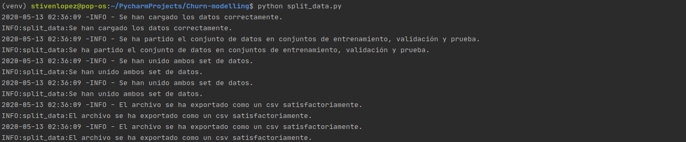
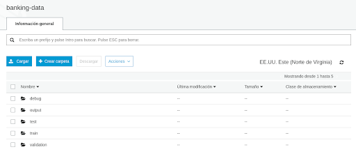

# Machine Learning Engineer - Capstone

## Motivation

Predicting which users will leave the company is important for a company because they can react quickly to dissuade the user from leaving, since for each company users are a very important asset. This project seeks to solve a case like the one mentioned.

## Instructions:

1. Run the following command at the root of the project, this will simply download the data from S3, it will partition the training, validation and test data and later upload it to a bucket in S3.
    `python split_data.py`
    

2. Open the S3 console and go to the bucket that you will use for the project, you should see something like the following:

In the previous image there are two more folders that are created in the construction of the model.

The custom pipeline is located in the scikit_preprocessing.py file that invokes the classes created in custom_pipeline.py and the inference_pipeline.ipynb file has all the development of the model construction using both containers.

## Results

The final model had the following performance metrics:

* AUC: 0.78

* Accuracy: 0.8

* Precision: 0.5

* Recall: 0.75

* F1 : 0.6

And a latency in inference of about 0.25 seconds.